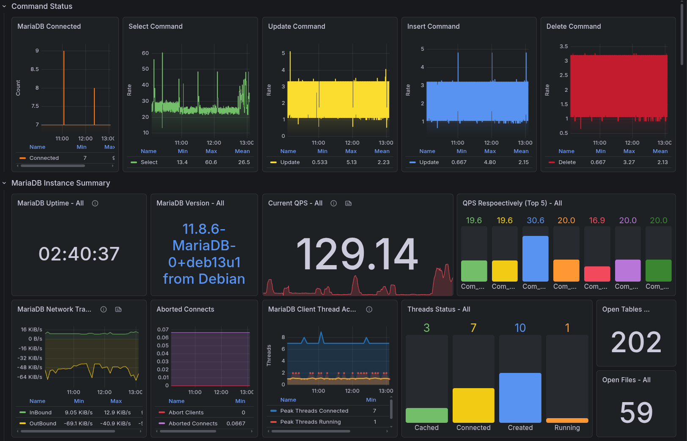
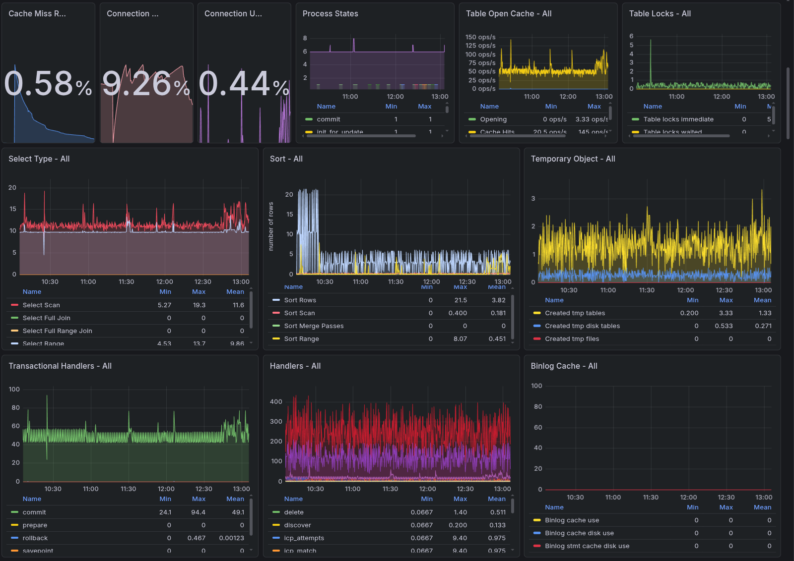
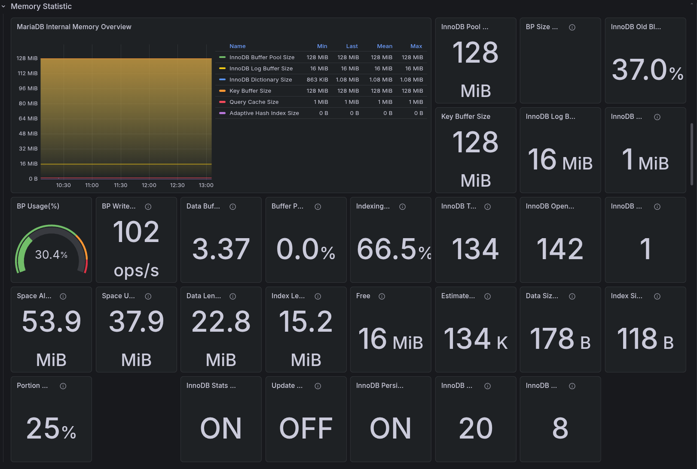
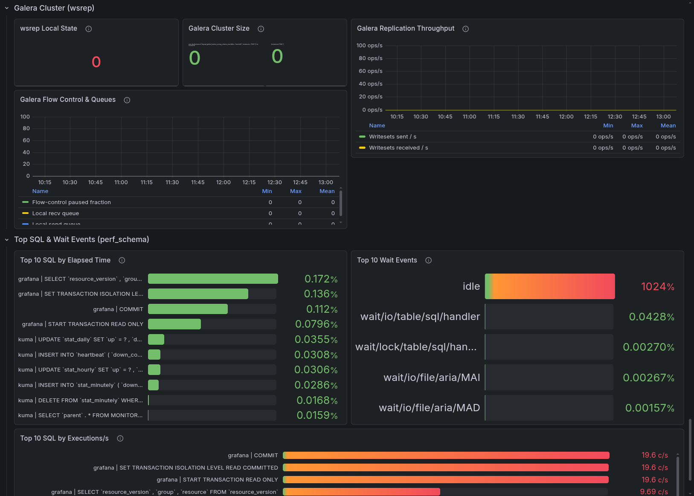
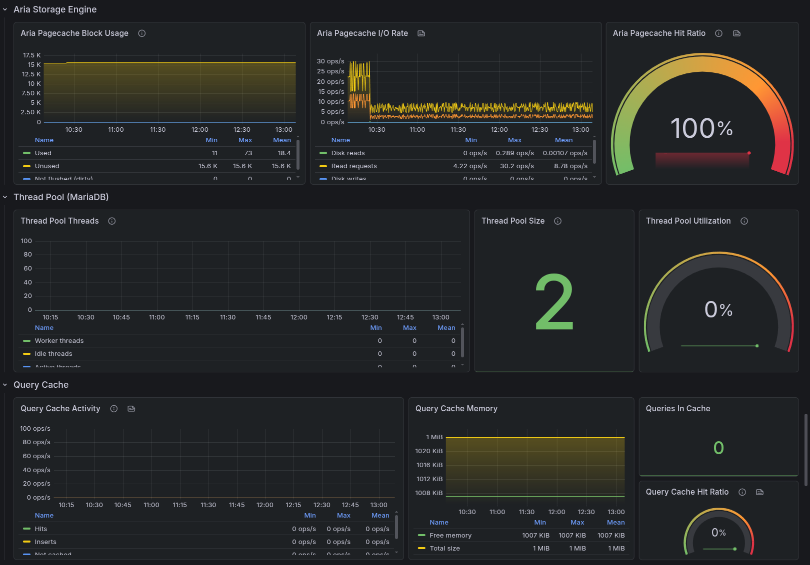

# MariaDB 11.x Grafana Dashboard

A Grafana dashboard for monitoring **MariaDB 11.x** using `prometheus/mysqld_exporter`.
It was adapted from a generic MySQL dashboard by adding MariaDB-specific panels and removing MySQL-only metrics.

## What's inside

The dashboard includes 11 collapsible rows covering the full monitoring stack:

| Row | Notes |
|---|---|
| Command Status | QPS, command mix, basic counters |
| MariaDB Instance Summary | Uptime, version, network, threads, connections |
| Memory Statistic | Buffer pool, key buffer, query cache, BP usage |
| InnoDB Statistics | Page activity, read-ahead, BP requests |
| InnoDB Locking | Row lock waits, deadlocks, lock timeouts |
| InnoDB Disk IO | Data/log bandwidth, fsyncs, request sizes |
| **Aria Storage Engine** | Page cache state, I/O rate, hit ratio (MariaDB-only engine) |
| **Thread Pool (MariaDB)** | Worker threads, idle threads, pool utilization |
| **Query Cache** | Hits, inserts, prunes, memory, hit ratio |
| **Galera Cluster (wsrep)** | Cluster state, replication throughput, flow control; safe when Galera is disabled (panels show 0) |
| **Top SQL & Wait Events** | AWR-style view: top 10 SQL by elapsed time, top 10 SQL by executions/s, top 10 wait events |

Rows marked in **bold** are MariaDB-specific additions not typically found in MySQL dashboards.

## Requirements

- **Grafana 13.0+** (the dashboard uses the v2 schema — `dashboard.grafana.app/v2`)
- **Prometheus** scraping `mysqld_exporter`
- **mysqld_exporter v0.15+** (tested with v0.17.2)
- **MariaDB 11.x** with `performance_schema = ON` (default)

## Installation

### 1. Import the dashboard

In Grafana: **Dashboards → New → Import** → upload [`mariadb_v1.json`](mariadb_v1.json).

### 2. Configure the datasource

The dashboard expects a Prometheus datasource. During import, Grafana will prompt you to select one.

### 3. Configure mysqld_exporter

The dashboard depends on a specific set of collector flags. Minimum working configuration:

```yaml
# docker-compose.yml
services:
  mysqld-exporter:
    image: prom/mysqld-exporter:v0.17.2
    container_name: mysqld-exporter
    restart: unless-stopped
    command:
      - "--config.my-cnf=/cfg/.my.cnf"
      - "--mysqld.address=192.168.1.xxx:3306"
      - "--collect.info_schema.tables"
      - "--collect.info_schema.innodb_metrics"
      - "--collect.info_schema.innodb_tablespaces"
      - "--collect.info_schema.innodb_cmp"
      - "--collect.info_schema.innodb_cmpmem"
      - "--collect.info_schema.processlist"
      - "--collect.info_schema.query_response_time"
      - "--collect.global_status"
      - "--collect.global_variables"
      - "--collect.slave_status"
      - "--collect.engine_innodb_status"
      - "--collect.perf_schema.tablelocks"
      - "--collect.perf_schema.eventswaits"
      - "--collect.perf_schema.eventsstatements"
      - "--collect.perf_schema.eventsstatements.limit=200"
      - "--collect.perf_schema.file_events"
      - "--collect.perf_schema.indexiowaits"
      - "--collect.perf_schema.tableiowaits"
      - "--web.listen-address=:9104"
    volumes:
      - /path/to/mysqld-exporter.cnf:/cfg/.my.cnf:ro
    ports:
      - "9104:9104"
```

A working example is available in [`docker-compose.yml`](docker-compose.yml).

The exporter also needs a client configuration file, for example `mysqld-exporter.cnf`:

```ini
[client]
user=exporter
password=xxxxxx
host=192.168.1.xxx
port=3306
```

The exporter's `.my.cnf` requires a user with the following grants:

```sql
CREATE USER 'exporter'@'%' IDENTIFIED BY 'xxxxxxxx';
GRANT PROCESS, REPLICATION CLIENT, SELECT ON *.* TO 'exporter'@'%';
FLUSH PRIVILEGES;
```

### 4. Configure `prometheus.yml`

Add a scrape job for `mysqld_exporter` to `prometheus.yml`:

```yaml
- job_name: 'mysqld_exporter'
  static_configs:
    - targets: ['192.168.1.xxx:9104']
      labels:
        instance: 'db'
        db: 'mariadb'
```

Then reload or restart Prometheus so the new target is picked up.

### 5. Required `performance_schema` and `statements_digest` settings

For the **Top SQL** panels, `performance-schema = ON` is required.
In addition, `performance-schema-consumer-statements-digest` should be verified and enabled if needed.

You can verify whether `performance_schema` is enabled with:

```sql
SHOW VARIABLES LIKE 'performance_schema';
```

You can check the current status of `statements_digest` with:

```sql
SELECT NAME, ENABLED
  FROM performance_schema.setup_consumers
 WHERE NAME = 'statements_digest';
```

If `performance_schema` or `statements_digest` is not enabled, or if the settings should persist after restart, add the following parameters to `my.cnf` under the `[mysqld]` section:

```ini
[mysqld]
performance-schema = ON
performance-schema-consumer-statements-digest = ON
```

## License

MIT — use it however you want. The original base came from a generic MySQL monitoring dashboard in the Grafana community catalog and was heavily modified for MariaDB.












